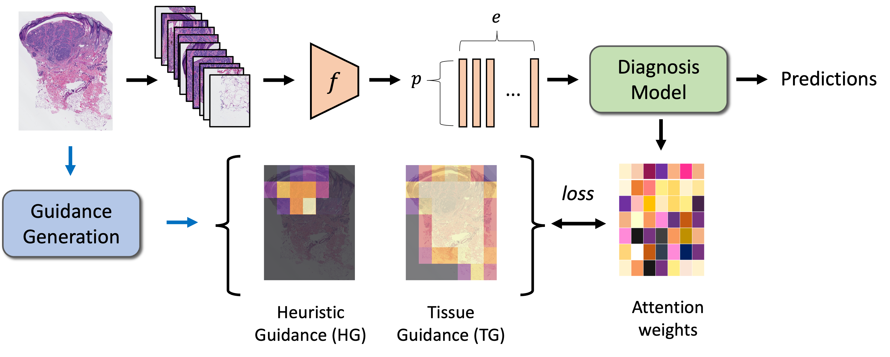
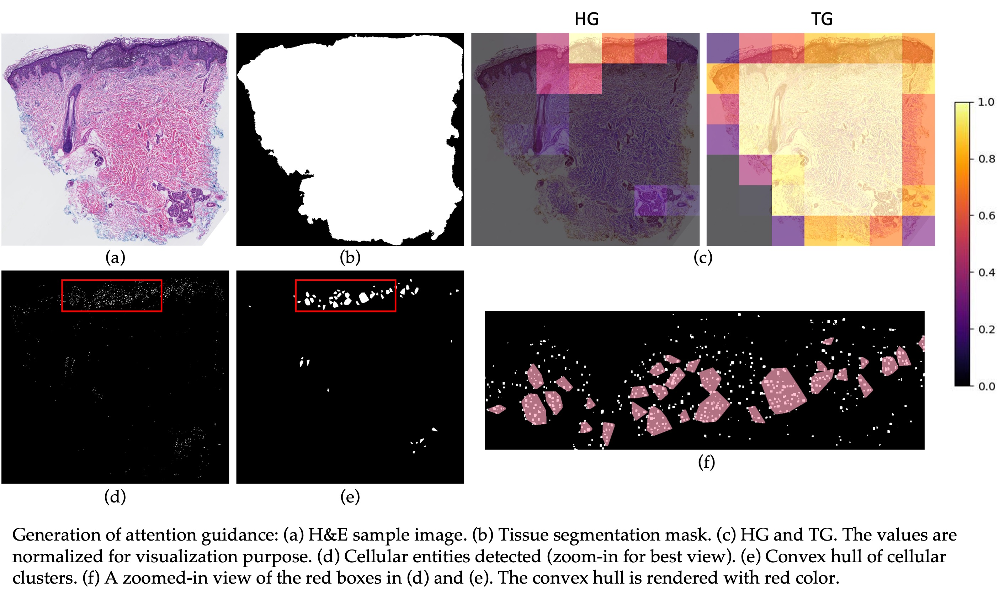

# Semantic-Aware Attention Guidance

<details>
<summary>
  <b>Semantics-Aware Attention Guidance for Diagnosing Whole Slide Images</b>, MICCAI 2024.
  <a href="https://arxiv.org/abs/2404.10894" target="blank">[arXiv]</a>
	<br><em><a href="https://kechunl.github.io/">Kechun Liu*</a>, <a href="https://meredith-wenjunwu.github.io/">Wenjun Wu*</a>, <a href="https://www.uclahealth.org/providers/joann-elmore">Joann G. Elmore</a>, <a href="https://homes.cs.washington.edu/~shapiro/">Linda G. Shapiro</a></em></br>
</summary>

```bash
@article{liu2024semantics,
  title={Semantics-Aware Attention Guidance for Diagnosing Whole Slide Images},
  author={Liu, Kechun and Wu, Wenjun and Elmore, Joann G and Shapiro, Linda G},
  journal={arXiv preprint arXiv:2404.10894},
  year={2024}
}
```
</details>





## Introduction

We introduce a novel framework named **Semantics-Aware Attention Guidance (SAG)**, which includes 1) a technique for converting diagnostically relevant entities into attention signals, and 2) a flexible attention loss that efficiently integrates various semantically significant information, such as tissue anatomy and cancerous regions.

## Installation

To clone this repository:
```bash
git clone https://github.com/kechunl/SAG.git
```

To install Python dependencies:
```
pip install -r requirements.txt
```
Note: Python = 3.9.X has been tested and recommended. 

To enable multi-task learning, follow the instructions to install [LibMTL](https://github.com/median-research-group/LibMTL).


## Data Preparation
### ScATNet
<details>
<summary>
    <b>Preprocessing</b>
</summary>

This step is highly dependent on the format of slide types. In this work, we use tissue regions per slide at resolution of x20 and downsize to get x12.5, x10, x7.5. Otsu threshold is used to [segment individual tissue slices](https://digitalslidearchive.github.io/HistomicsTK/examples/simple_tissue_detection.html) from a slide. 

For each slide, we computed soft labels using singular value decomposition as described in [ScATNet](https://pubmed.ncbi.nlm.nih.gov/35211363/). 
</details>

<details>
<summary>
    <b>Feature Extraction</b>
</summary>

We use a pretrained model to encode an embedding vector for each patch. 

Heuristic guidance (**HG**) is extracted from a specific semantic signal (e.g. grouped melanocytes in melanoma data, metastasis mask in breast cancer data, etc.). Please choose your HG accordingly. 

Tissue guidance (**TG**) is extracted from the binary slide mask in our experiments. However, it can encompass different anatomical maps, allowing models to learn representations of various tissues.

Implementation details are included in the paper.


</details>

<details>
<summary>
    <b>Example Dataset File</b>
</summary>

Check `sample_data` for the format used in dataset files of our experiments. Each line contains one whole slide image slice and follows the following format:
```
patient_id/slices_filename;class_label;soft_label_vector
```
</details>

### ABMIL
Please refer to [ReMix](ReMix/README.md) for more details.


## Training SAG

To train ScATNet, run:

```
cd ScATNet
bash train.sh
```

To train ABMIL, run:

```
cd ReMix
bash train.sh
```

## Acknowledgement
This project is built based on [ScATNet](https://github.com/meredith-wenjunwu/ScATNet) and [ReMix](https://github.com/TencentAILabHealthcare/ReMix).